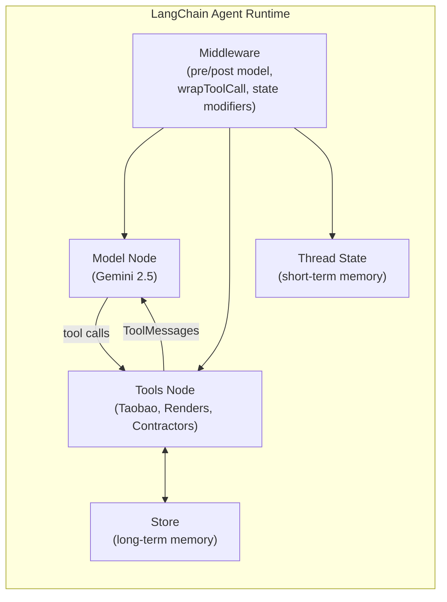
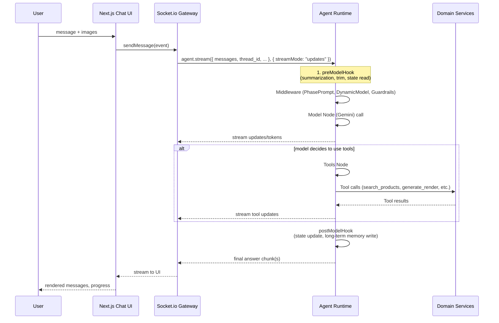

# Agentic Architecture

## 1. High-level agentic system on LangChain v1

### 1.1 System architecture (with LangChain v1 agent runtime)

```mermaid
flowchart LR
  subgraph Client["Client (Next.js on Vercel)"]
    ChatUI["Renovation Chat UI<br/>(React, socket.io-client)"]
    Dashboard["Project dashboard<br/>(rooms, budget, renders)"]
  end

  subgraph APIGW["Backend Container - API & Agent Gateway"]
    RestAPI["REST Routes<br/>(auth, sessions, Stripe)"]
    WS["Socket.io Gateway<br/>(agent streaming bridge)"]
  end

  subgraph AgentRuntime["Backend Container - Agent Runtime<br/>LangChain v1 + LangGraph"]
    Agent["createAgent()<br/>(Gemini + tools)"]
    Middleware["Middleware stack<br/>(logging, summarization,<br/>model routing, guardrails)"]
    Checkpointer["Checkpointer<br/>(PostgresSaver)"]
    Store["Long-term Store<br/>(LangGraph Store)"]
  end

  subgraph DomainServices["Domain Services"]
    IntakeSvc["Intake Service<br/>(Supabase via Drizzle)"]
    ProductSvc["Product Service<br/>(Taobao DB)"]
    RenderSvc["Render Service<br/>(Nano Banana / Supabase Storage)"]
    ContractorSvc["Contractor Service<br/>(verified partners)"]
    ReportSvc["Report Service<br/>(PDF + Storage)"]
  end

  subgraph Data["Data & Infra"]
    SupaDB["Supabase Postgres"]
    SupaStorage["Supabase Storage<br/>(user uploads, PDFs)"]
    Supabase Storage["Supabase Storage<br/>(style sets & renders)"]
    Stripe["Stripe"]
  end

  Client -->|HTTP| APIGW
  ChatUI <-->|WebSocket| WS

  WS --> Agent
  RestAPI --> DomainServices

  AgentRuntime --> DomainServices
  AgentRuntime --> SupaDB
  AgentRuntime --> Store
  DomainServices --> SupaDB
  DomainServices --> SupaStorage
  DomainServices --> Supabase Storage

  RestAPI --> Stripe
  Stripe --> RestAPI

```

Key LangChain v1 bits:

- `createAgent({ model, tools, middleware, checkpointer })` builds a **graph-based agent** on top of LangGraph. ([LangChain Docs](https://docs.langchain.com/oss/javascript/langchain/agents))
- Agents use **tools** (via `tool()` + zod schemas) to call your domain services. ([LangChain Docs](https://docs.langchain.com/oss/javascript/langchain/agents))
- **Short-term memory** is built in via `checkpointer` (MemorySaver in dev, PostgresSaver in prod). ([LangChain Docs](https://docs.langchain.com/oss/javascript/langchain/short-term-memory))
- **Long-term memory** goes into a LangGraph `Store` (e.g. user style prefs, contractor history). ([LangChain Docs](https://docs.langchain.com/oss/javascript/langchain/long-term-memory))
- **Middleware** lets you shape context at each step (model call, tool call, before/after hooks). ([LangChain Docs](https://docs.langchain.com/oss/javascript/langchain/agents))

---

## 2. Memory architecture: threads, state, and store

LangChain v1 wants you to think in:

- **Threads** → short-term memory scopes (`thread_id`)
- **State** → the graph state for that thread (messages + extra fields)
- **Store** → long-term memory across threads (preferences, contractors, etc.) ([LangChain Docs](https://docs.langchain.com/oss/javascript/langchain/short-term-memory))

### 2.1 Short-term memory (per renovation project)

You’ll create the agent with a **checkpointer**:

```tsx
import { createAgent } from "langchain";
import { PostgresSaver } from "@langchain/langgraph-checkpoint-postgres";

const checkpointer = PostgresSaver.fromConnString(process.env.DB_URI!);

export const agent = createAgent({
  model: "google:gemini-2.5-flash",
  tools: [/* tools below */],
  middleware: [/* summarization, state extension, guardrails */],
  checkpointer,
});

```

Each renovation session maps to a **thread**:

- `configurable: { thread_id: renovationSessionId }` on `agent.invoke` / `agent.stream`. ([LangChain Docs](https://docs.langchain.com/oss/javascript/langchain/short-term-memory))

We also extend state with a **custom schema** for `phase`, `roomChecklist`, etc. using middleware’s `stateSchema`: ([LangChain Docs](https://docs.langchain.com/oss/javascript/langchain/short-term-memory))

```tsx
const RenovationState = z.object({
  phase: z.enum(["INTAKE", "CHECKLIST", "PLAN", "RENDER", "ITERATE", "COMPLETE"]),
  sessionId: z.string().uuid(),
  userId: z.string(),
  rooms: z.array(z.object({
    roomId: z.string().uuid(),
    name: z.string(),
    roomType: z.string()
  })).optional(),
  budget: z.number().optional(),
  currency: z.string().optional(),
});

const stateExtensionMiddleware = createMiddleware({
  name: "RenovationState",
  stateSchema: RenovationState,
});

```

The agent automatically:

- **Reads state** at each step (model or tools)
- **Writes state** (messages + state updates) via the checkpointer

We can add **summarization middleware** so long chats don’t blow Gemini’s context: ([LangChain Docs](https://docs.langchain.com/oss/javascript/langchain/short-term-memory))

```tsx
const memoryMiddleware = summarizationMiddleware({
  model: "google:gemini-2.5-flash", // or cheap mini model
  trigger: [{ messages: 40 }],      // when to summarize
  keep: { messages: 10 },           // how much recent context to keep
});

```

### 2.2 Long-term memory (cross projects)

Use LangGraph `Store`:

- Namespace: `[userId, "home-renovation"]`
- Values: preferences, “don’t like dark colors”, “always wants built-in storage”, preferred contractors, etc. ([LangChain Docs](https://docs.langchain.com/oss/javascript/langchain/long-term-memory))

```tsx
import { InMemoryStore } from "@langchain/langgraph";
// or DB-backed store in prod

const store = new InMemoryStore({
  index: { embed, dims: 1536 } // hook up real embeddings later
});

```

In **tools**, we use `get_store()` (from context-engineering docs) to read/write: ([LangChain Docs](https://docs.langchain.com/oss/javascript/langchain/context-engineering))

- On **INTAKE** completion: write style + budget ranges into store
- On **PLAN/ITERATE**: read them back to keep recommendations consistent
- On **CONTRACTORS**: persist contractors they liked / used previously

---

## 3. Agent loop, tools, middleware: how they coordinate

LangChain’s conceptual model:

- **Agent loop**: model → tools → model → … until final answer. ([LangChain Docs](https://docs.langchain.com/oss/javascript/langchain/context-engineering))
- **You control**:
    - **Model context** (system prompt, tools, response format)
    - **Tool context** (what tools read/write, long-term store)
    - **Life-cycle context** (middleware between steps: summarization, logging, guardrails, dynamic model selection). ([LangChain Docs](https://docs.langchain.com/oss/javascript/langchain/context-engineering))

### 3.1 Agent context & tools diagram



---

## 4. Tool design: services the agent can call

You already designed the high-level tools earlier; now we align with **LangChain v1 tool API** (`tool(fn, { name, description, schema })`). ([LangChain Docs](https://docs.langchain.com/oss/javascript/langchain/agents))

### 4.1 Categories

1. **Session & phase tools**
    - `update_phase` – update phase in Supabase & state
    - `save_intake_state`, `save_checklist_state`, `save_plan_state`, `save_renders_state`
2. **Design reasoning tools**
    - `get_style_examples` – fetch moodboard URLs from Supabase Storage
    - `search_products` – Taobao furniture search via Supabase
    - `check_budget` – validate BOM vs budget
3. **Image tools**
    - `generate_render` – Nano Banana Pro / Gemini image API; store results
4. **Report & payment tools**
    - `create_pdf_report` – after payment, generate PDF
    - (Optionally) `get_payment_status` – read from Supabase/Stripe sync tables
5. **Contractor tools**
    - `search_contractors` – query internal DB of vetted contractors (location, scope, budget tier)
    - `create_contractor_lead` – create a lead record + maybe send email/notification

### 4.2 Tool ↔ service mapping

```mermaid
flowchart LR
  Agent[LangChain Agent] -->|tool: save_intake_state| IntakeSvc
  Agent -->|tool: search_products| ProductSvc
  Agent -->|tool: generate_render| RenderSvc
  Agent -->|tool: create_pdf_report| ReportSvc
  Agent -->|tool: search_contractors| ContractorSvc

  IntakeSvc --> SupaDB[(Supabase Postgres)]
  ProductSvc --> SupaDB
  RenderSvc --> Supabase Storage[(Supabase Storage Buckets)]
  ReportSvc --> SupaStorage[(Supabase Storage)]
  ContractorSvc --> SupaDB

```

Each service is a plain TS module (or microservice) that the tool calls into.

---

## 5. Middleware: context engineering for this specific app

The v1 docs push you to treat “context engineering” as **middleware + state + store**. ([LangChain Docs](https://docs.langchain.com/oss/javascript/langchain/context-engineering))

### 5.1 Middleware stack for Unwind Renovation Planner

Suggested stack:

1. **State extension middleware (RenovationState)**
    - Adds `phase`, `sessionId`, `userId`, `budget`, etc. to state (already sketched).
    - Lets your tools update state by returning partial state changes.
2. **Phase-aware system prompt middleware (Model Context)**
    - Uses `wrapModelCall` to inject phase-specific system text:

```tsx
const phasePromptMiddleware = createMiddleware({
  name: "PhasePrompt",
  wrapModelCall: async (request, handler) => {
    const { phase } = request.state as z.infer<typeof RenovationState>;

    const phaseInstruction = {
      INTAKE: "You are in INTAKE phase: focus on gathering room photos, layout, styles, and budget. Ask clarifying questions.",
      CHECKLIST: "You are in CHECKLIST phase: propose items per room and ask user to mark must-have vs nice-to-have.",
      PLAN: "You are in PLAN phase: choose specific Taobao items and keep total under budget.",
      RENDER: "You are in RENDER phase: plan the visuals and decide when to call generate_render.",
      ITERATE: "You are in ITERATE phase: refine plan and renders based on feedback.",
      COMPLETE: "You are in COMPLETE phase: answer questions about the final plan.",
    }[phase];

    return handler({
      ...request,
      messages: [
        { role: "system", content: phaseInstruction },
        ...request.messages,
      ],
    });
  },
});

```

1. **Dynamic model selection middleware**
    - Use cheap model for chit-chat, full Gemini/Nano for heavy reasoning or long contexts. ([LangChain Docs](https://docs.langchain.com/oss/javascript/langchain/agents))
2. **Summarization middleware (built-in)**
    - Automatically summarize older messages. ([LangChain Docs](https://docs.langchain.com/oss/javascript/langchain/short-term-memory))
3. **Guardrail middleware** (custom)
    - `wrapModelCall` / `postModelHook` to:
        - Strip out impossible promises (“I’ll book a contractor for you” → convert to “I’ll connect you to a contractor lead form”).
        - Enforce safety guidelines (no structural engineering advice beyond scope).
4. **Tool error middleware**
    - `wrapToolCall` to convert exceptions into `ToolMessage` with user-friendly error text (as in docs). ([LangChain Docs](https://docs.langchain.com/oss/javascript/langchain/agents))

### 5.2 Life-cycle view (where middleware hooks)



Streaming is **native** (`agent.stream(..., { streamMode })`) and you just forward chunks over Socket.io. ([LangChain Docs](https://docs.langchain.com/oss/javascript/langchain/streaming))

---

## 6. How the agent actually “understands the user & house”

Putting it together, step-by-step:

### 6.1 Understanding how they want the house to look

- **INTAKE phase**:
    - Model prompt is phase-aware via middleware.
    - User uploads photos + layout → front-end sends URLs in `messages`.
    - Agent uses:
        - **Short-term state**: `rooms`, `sessionId`
        - **Tools**:
            - `get_style_examples` to show wabi-sabi/japandi/etc moodboards
            - `save_intake_state` to persist style, budget, room metadata
        - **Long-term store**: records global style preferences (“user likes warm wood tones, hates glossy surfaces”).

### 6.2 Deciding what items they need to buy

- **CHECKLIST + PLAN phases**:
    - Agent reads **intake state** + long-term style preferences.
    - Uses:
        - `search_products` + `check_budget` tools for each room/category
        - `save_checklist_state` and `save_plan_state` to persist BOM
    - Middleware:
        - Summarization to keep context tight
        - Guardrails to avoid recommending weird items (e.g. no obviously wrong sizes or categories)

### 6.3 Visualizing the outcome

- **RENDER + ITERATE phases**:
    - Agent uses existing `room_assets` as base where possible.
    - Constructs rich, style-aware prompts and calls `generate_render`.
    - Stores URLs via `save_renders_state`.
    - Short-term state tracks which rooms have “final enough” renders.

### 6.4 Connecting them with reputable contractors

Add a **contractor sub-flow** the agent can enter at PLAN/ITERATE:

- **Tools:**
    - `search_contractors({ location, budgetTier, scope })`
    - `create_contractor_lead({ contractorId, sessionId, notes })`
- **Context:**
    - Long-term store holds:
        - contractors the user liked / disliked
        - historical spend level
    - Middleware `wrapToolCall` for `search_contractors` can inject user’s home city from runtime context (e.g. `request.runtime.userLocation`).

**Flow:**

1. Agent asks: “Do you want help shortlisting contractors for this plan?”
2. If yes:
    - Calls `search_contractors` with data from **state** (rooms, budget) + **store** (location, preferences).
    - Presents 3–5 options with pros/cons, approximate price tiers.
3. If user picks one:
    - Calls `create_contractor_lead` to record the match and maybe send the plan + renders as attachments.

All of this is just **more tools + little bit of state & store**, no need for a second agent.

---

## 7. Concrete `createAgent` wiring skeleton

To give your brother something nearly plug-and-play:

```tsx
import { createAgent, summarizationMiddleware } from "langchain";
import { MemorySaver } from "@langchain/langgraph";
import { RenovationStateMiddleware } from "./middleware/state";
import { phasePromptMiddleware } from "./middleware/phasePrompt";
import { guardrailMiddleware } from "./middleware/guardrails";
import {
  updatePhaseTool,
  saveIntakeStateTool,
  saveChecklistStateTool,
  searchProductsTool,
  checkBudgetTool,
  generateRenderTool,
  saveRendersStateTool,
  searchContractorsTool,
  createContractorLeadTool,
} from "./tools";

const checkpointer = new MemorySaver(); // swap for PostgresSaver in prod

export const renovationAgent = createAgent({
  model: "google:gemini-2.5-flash",
  tools: [
    updatePhaseTool,
    saveIntakeStateTool,
    saveChecklistStateTool,
    searchProductsTool,
    checkBudgetTool,
    generateRenderTool,
    saveRendersStateTool,
    searchContractorsTool,
    createContractorLeadTool,
  ],
  middleware: [
    RenovationStateMiddleware,
    phasePromptMiddleware,
    summarizationMiddleware({ model: "google:gemini-2.5-flash", trigger: [{ messages: 40 }], keep: { messages: 10 } }),
    guardrailMiddleware,
  ],
  checkpointer,
});

```

Front-end then just:

- calls `renovationAgent.stream({ messages: [...], sessionId, phase, userId }, { streamMode: "updates", configurable: { thread_id: sessionId } })` on the backend,
- and bridges the stream to the browser over Socket.io.

---

If you want, next step I can zoom all the way in on **one flow** (e.g. “user uploads master bedroom pictures → final master bedroom PDF section”) and write **exact LCEL-ish code + prompts + tool calls** so your brother has a reference implementation pattern.