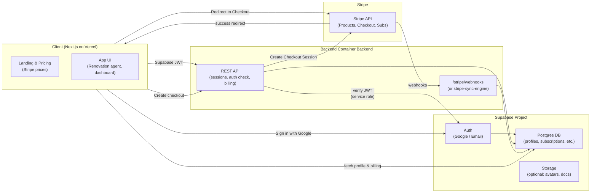
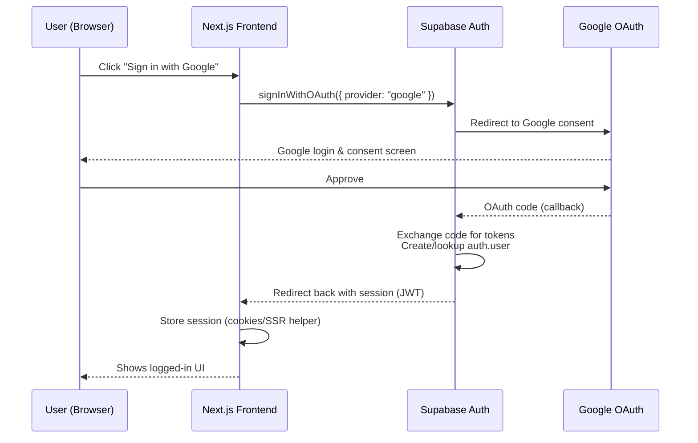
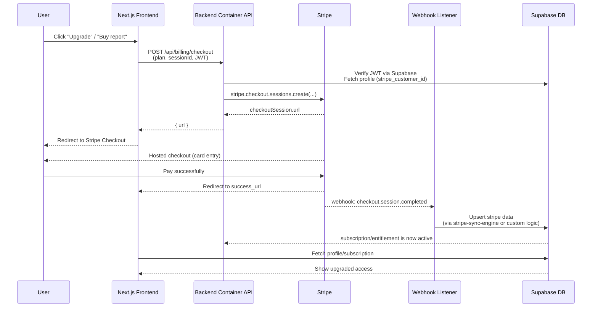
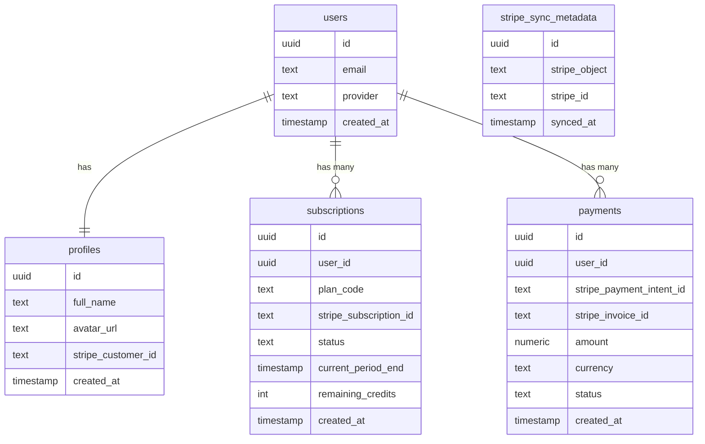
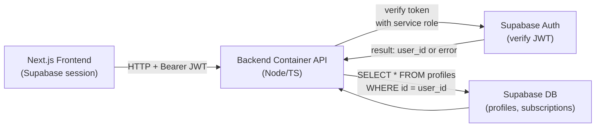

# Authentication and Payments Architecture

## 1. Architecture overview

### 1.1 Components

- **Next.js frontend (Vercel)**
    - Uses **Supabase Auth** for “Sign in with Google” (Gmail). ([Supabase](https://supabase.com/docs/guides/auth?utm_source=chatgpt.com))
    - Shows Stripe pricing, calls backend to create Stripe Checkout.
- **Supabase**
    - `auth.users`, `auth.identities` for login. ([Supabase](https://supabase.com/docs/guides/auth?utm_source=chatgpt.com))
    - `public.profiles` table for app-specific profile.
    - `public.subscriptions` / `public.payments` for your own view of billing.
    - Optionally **`stripe` schema** populated by **Stripe Sync Engine**. ([supabase.github.io](https://supabase.github.io/stripe-sync-engine/?utm_source=chatgpt.com))
- **Backend Container backend**
    - Verifies Supabase JWT (Google-auth’d user) using service role. ([Supabase](https://supabase.com/docs/guides/auth?utm_source=chatgpt.com))
    - Creates Stripe Checkout sessions.
    - Handles Stripe webhooks (or runs Stripe Sync Engine as a sidecar).
- **Stripe**
    - Products, prices, customers, subscriptions.
    - Sends webhooks → backend → Supabase.

### 1.2 System architecture diagram



---

## 2. Gmail (Google) login with Supabase

We’re **not** directly integrating with Gmail API. We’re using **Google OAuth via Supabase Auth**, which authenticates Gmail/Google users and gives us a Supabase JWT.

### 2.1 Configuring Google provider (one-time setup)

In Supabase:

1. Go to **Authentication → Providers → Google**, enable it. ([Supabase](https://supabase.com/docs/guides/auth/social-login/auth-google?utm_source=chatgpt.com))
2. In **Google Cloud Console**:
    - Create OAuth client (type: *Web application*).
    - Add **Authorized redirect URI** = your Supabase project’s callback URL (from provider page).
3. Paste `client_id` and `client_secret` into Supabase Google provider config. ([Supabase](https://supabase.com/docs/guides/auth/social-login/auth-google?utm_source=chatgpt.com))

Supabase now handles **all the OAuth dance** for you.

### 2.2 Login flow (frontend ↔ Supabase)



Code (client-side example):

```tsx
const supabase = createBrowserClient(
  process.env.NEXT_PUBLIC_SUPABASE_URL!,
  process.env.NEXT_PUBLIC_SUPABASE_ANON_KEY!
);

await supabase.auth.signInWithOAuth({
  provider: "google",
  options: {
    redirectTo: `${window.location.origin}/auth/callback`,
  },
});

```

On `/auth/callback`, you use `supabase.auth.getSession()` (or the SSR helpers) to store the session in cookies.

### 2.3 Mapping `auth.users` → `public.profiles`

Pattern:

- Supabase maintains **`auth.users`** (id, email, provider).
- You create a trigger or backend handler that **inserts/updates `public.profiles`** whenever a new auth user appears. ([Supabase](https://supabase.com/docs/guides/auth?utm_source=chatgpt.com))

Profiles table (simplified):

```sql
create table public.profiles (
  id uuid primary key references auth.users (id) on delete cascade,
  full_name text,
  avatar_url text,
  stripe_customer_id text,
  created_at timestamptz default now()
);

```

---

## 3. Stripe + Supabase billing layer

Two main options:

- **Option A – Minimal:** Backend Container handles webhooks and writes to `public.subscriptions`.
- **Option B – Rich:** Use **Stripe Sync Engine** to mirror Stripe into a `stripe` schema, then derive app tables/views. ([supabase.github.io](https://supabase.github.io/stripe-sync-engine/?utm_source=chatgpt.com))

For your renovation SaaS, I’d do:

- Stripe Sync Engine for robust data & future analytics.
- **Thin app tables** (`subscriptions`, `payments`) summarising what the app cares about.

### 3.1 Stripe checkout & webhook flow



If you use **Stripe Sync Engine**:

- You configure it to listen to Stripe webhooks and sync to `stripe.*` tables in your Supabase Postgres. ([supabase.github.io](https://supabase.github.io/stripe-sync-engine/?utm_source=chatgpt.com))
- Your app’s webhook (Backend Container) can either:
    - Be **just the sync-engine** (Fastify app in its own container), or
    - Or you call the stripe-sync-engine library from your own Node server.

In either case, after a `checkout.session.completed` / `customer.subscription.updated` event, your DB now has:

- A Stripe **customer** row tied to the user (via `stripe_customer_id`).
- A Stripe **subscription** row with `status = 'active'`, etc.

Your app can then update `public.subscriptions` as a higher-level summary.

---

## 4. Database layout for auth & billing

This ERD focuses just on auth/billing.



Notes:

- In practice, `users` is `auth.users` (managed by Supabase), but we often create a **view** or **shadow table** for ERD clarity. ([Supabase](https://supabase.com/docs/guides/auth?utm_source=chatgpt.com))
- If you use **Stripe Sync Engine**, you’ll also have a full `stripe` schema with tables like `stripe.customers`, `stripe.subscriptions`, etc., which you can join on `stripe_customer_id`. ([supabase.github.io](https://supabase.github.io/stripe-sync-engine/?utm_source=chatgpt.com))

---

## 5. Backend auth layer (Backend Container)

Your Backend Container backend will:

1. Receive requests from the Next.js frontend with `Authorization: Bearer <supabase_jwt>`.
2. Validate the JWT using the **Supabase service role key** or JWKS. ([Supabase](https://supabase.com/docs/guides/auth?utm_source=chatgpt.com))
3. Map `user.id` → `profiles.row` → `stripe_customer_id` to decide what the user is allowed to do.

### 5.1 Auth middleware flow



In code (rough sketch):

```tsx
import { createClient } from "@supabase/supabase-js";

const supabaseAdmin = createClient(
  process.env.SUPABASE_URL!,
  process.env.SUPABASE_SERVICE_ROLE_KEY!
);

export async function authMiddleware(req, res, next) {
  const authHeader = req.headers.authorization || "";
  const token = authHeader.replace("Bearer ", "");

  if (!token) return res.status(401).json({ error: "Missing token" });

  const { data, error } = await supabaseAdmin.auth.getUser(token);
  if (error || !data.user) {
    return res.status(401).json({ error: "Invalid token" });
  }

  (req as any).user = data.user;
  next();
}

```

Use this middleware on:

- `/api/sessions/*`
- `/api/billing/checkout`
- anything that modifies user-specific state.

### 5.2 Billing API patterns

**Create checkout session endpoint:**

- Input: `plan_code`, maybe `renovation_session_id`.
- Steps:
    1. Auth middleware → `req.user`.
    2. Load `profiles` row; create Stripe customer if `stripe_customer_id` is null.
    3. Use Stripe SDK to `checkout.sessions.create`.
    4. Return `session.url` to frontend.

**Entitlement checks:**

- For “generate PDF report” route:
    1. Check `subscriptions.status === 'active'` and `remaining_credits > 0`.
    2. Decrement `remaining_credits`.
    3. Proceed to generate PDF.

---

## 6. Concrete setup steps

### 6.1 Google / Gmail login

1. **Supabase Auth Google Provider**: enable and configure as per docs. ([Supabase](https://supabase.com/docs/guides/auth/social-login/auth-google?utm_source=chatgpt.com))
2. **Google Cloud**:
    - OAuth client, redirect URI = `https://<project-ref>.supabase.co/auth/v1/callback`.
3. **Next.js**:
    - Use `@supabase/ssr` or `@supabase/auth-helpers-nextjs` to manage session cookies. ([Supabase](https://supabase.com/docs/guides/auth?utm_source=chatgpt.com))
4. **Profiles table** + trigger / API to populate from `auth.users`.

### 6.2 Stripe billing

1. **Create Stripe products & prices** for your renovation plans.
2. **Deploy Stripe Sync Engine** (recommended):
    - Point it to the same Postgres as Supabase.
    - Configure Stripe webhook endpoint to the sync-engine’s `/webhooks`. ([supabase.github.io](https://supabase.github.io/stripe-sync-engine/?utm_source=chatgpt.com))
3. **Add app-level tables** (`subscriptions`, `payments`) that join onto `stripe` schema.
4. **Backend Container API**:
    - `/api/billing/checkout` (auth-protected)
    - optionally `/api/billing/portal` to create Stripe Billing Portal sessions.
5. **Frontend**:
    - Show plan cards using static config or by reading from Supabase `prices` table. ([DEV Community](https://dev.to/alexzrlu/nextjs-supabase-stripe-subscriptions-integration-818?utm_source=chatgpt.com))
    - Call `/api/billing/checkout` → redirect to returned URL.

### 6.3 Security checklist

- Use **RLS** on `profiles`, `subscriptions`, `payments`, only allow `user_id = auth.uid()`. ([Supabase](https://supabase.com/docs/guides/auth?utm_source=chatgpt.com))
- Never expose **service role key** to the frontend (Backend Container only).
- Validate Stripe webhook signatures with `STRIPE_WEBHOOK_SECRET`.
- Use HTTPS for all URLs (Vercel & Backend Container handle this by default).