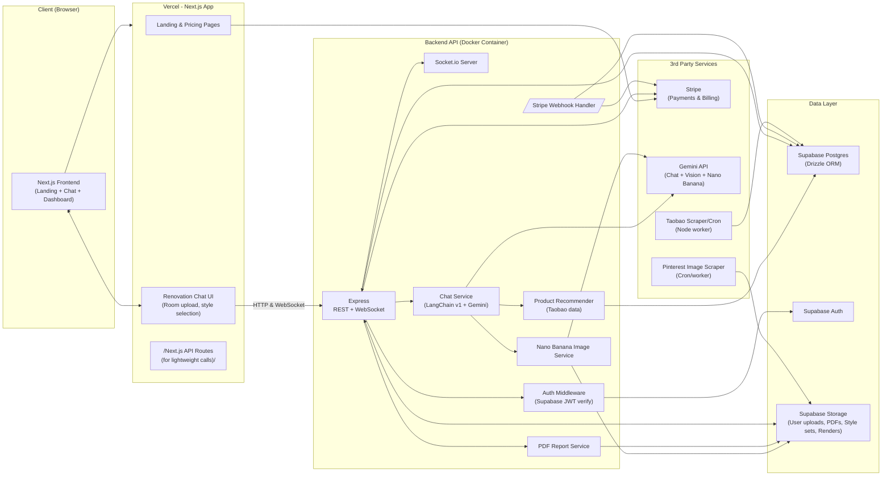
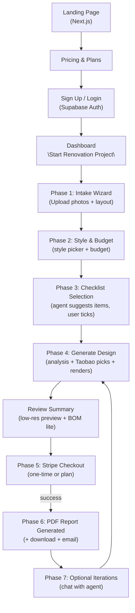
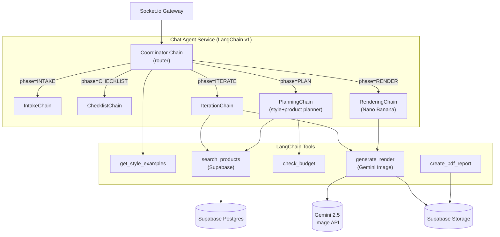
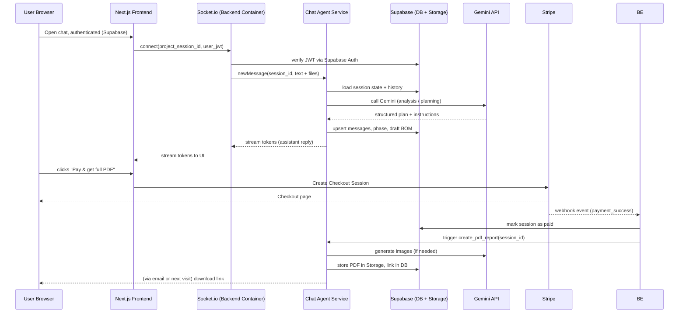
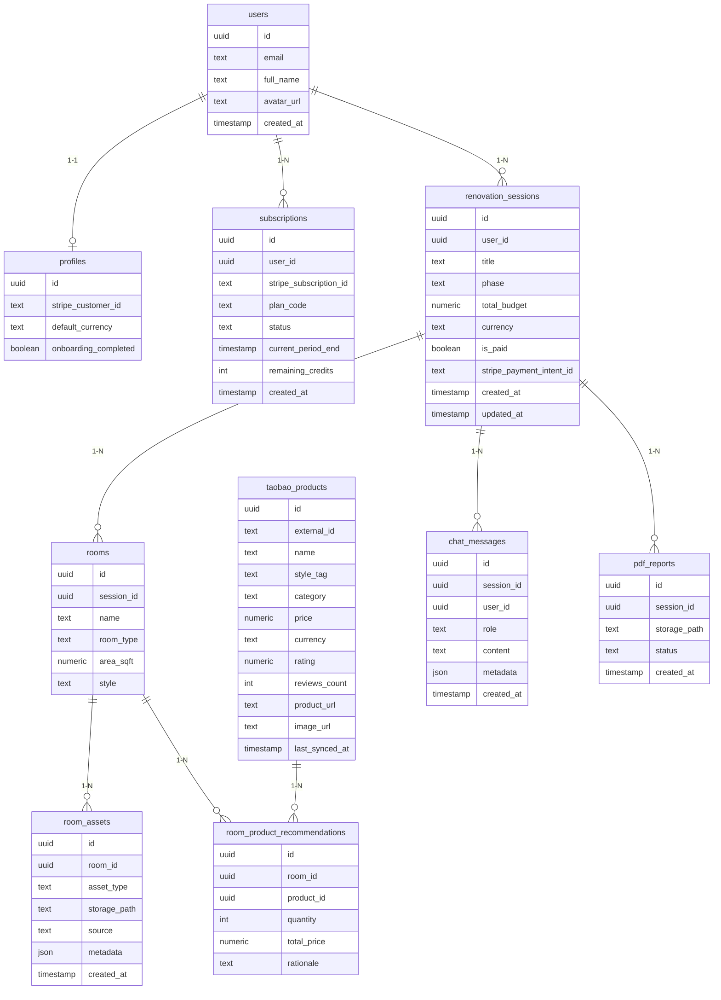

# Full System Architecture

## 1. High-level system architecture

**Tech stack you specified**

- **Frontend:** Next.js (App Router) + TypeScript on Vercel
- **Backend:** Node/TS Docker container, Socket.io, LangChain v1, Gemini (chat + Nano Banana image)
- **Backend data:** Supabase Postgres + Drizzle ORM
- **Auth & DB:** Supabase Auth & DB
- **Payments:** Stripe (Checkout / Subscriptions) integrated with Supabase tables via webhooks / stripe-sync-engine ([GitHub](https://github.com/supabase/stripe-sync-engine?utm_source=chatgpt.com))
- **Storage:**
    - Supabase Storage for all file storage (user uploads, room photos, floor plans, PDFs, Pinterest style image sets, Nano Banana render artifacts)
- **LLM & image gen:**
    - `ChatGoogleGenerativeAI` from `@langchain/google-genai` for Gemini 2.5 (text+vision) ([LangChain Docs](https://docs.langchain.com/oss/javascript/integrations/chat/google_generative_ai?utm_source=chatgpt.com))
    - Gemini 2.5 Flash Image (“Nano Banana”) for image generation/edit ([unwind ai](https://www.theunwindai.com/p/build-an-ai-home-renovation-planner-agent-using-nano-banana))
- **External data:** Taobao scraper/crawler microservice (Node/TS) writing product data into Supabase

### 1.1 System component diagram



---

## 2. UX & phase flow (agent-aware phases)

Your agent should know which phase it’s in and what to ask next. Store `phase` on the `renovation_sessions` row and pass it into the LangChain `config` so the prompt/logic changes.

### 2.1 Phase list

1. **Phase 0 – Onboarding & Auth**
    - User signs up/in (Supabase Auth)
    - Chooses free trial vs paid plan
2. **Phase 1 – Project intake**
    - Upload room photos (multiple angles + rooms)
    - Upload floor plan image / PDF
    - Select style(s): wabi-sabi / japandi / brutalist / scandinavian
    - Provide budget (overall or per-room)
3. **Phase 2 – Checklist + constraints**
    - Agent proposes checklist of items for each room **given style + budget**
    - User ticks items they care about (e.g., sofa, rugs, lighting, storage, plants, etc.)
4. **Phase 3 – Design planning + product selection**
    - Agent uses Gemini vision to analyze photos + layout
    - Uses Taobao product DB to pick skus, prices, ratings, links within budget
    - Builds per-room BOM (bill of materials) + budget breakdown
5. **Phase 4 – Rendering**
    - Agent calls Nano Banana Pro to generate final room visuals:
        - Option A: edit user’s uploaded photos
        - Option B: generate from layout + description
6. **Phase 5 – Payment gate**
    - Show preview summary (low-res image + text summary)
    - Stripe Checkout for one-time payment or use credits from subscription plan
7. **Phase 6 – Deliverables**
    - Generate PDF report (room visuals + BOM + shopping links + budget summary)
    - Store PDF in Supabase Storage; share download link and email
8. **Phase 7 – Follow-ups & iterations**
    - User requests tweaks (“change sofa to darker grey”)
    - Agent re-uses previous state + images to generate new renders + updated PDF (depending on plan).

### 2.2 UX flow diagram



---

## 3. Backend & agent system design

### 3.1 Agent pipeline (LangChain v1 + Gemini)

Use LangChain.js v1 with `ChatGoogleGenerativeAI` for text+vision and tools for products/renders. ([LangChain Docs](https://docs.langchain.com/oss/javascript/integrations/chat/google_generative_ai?utm_source=chatgpt.com))

**Key pieces:**

- **Model wrapper:**
    - `const model = new ChatGoogleGenerativeAI({ model: "gemini-2.5-flash", apiKey: ... })`
- **Image generation service:**
    - Use Gemini images mode / Nano Banana (e.g. `gemini-2.5-flash-image`) for render generation/edit. ([Google AI for Developers](https://ai.google.dev/gemini-api/docs?utm_source=chatgpt.com))
- **Memory:**
    - `PostgresChatMessageHistory` (LangChain community) configured with Supabase connection; or custom `Messages` table + adapter. ([v03.api.js.langchain.com](https://v03.api.js.langchain.com/classes/_langchain_community.stores_message_postgres.PostgresChatMessageHistory.html?utm_source=chatgpt.com))
- **State:**
    - `renovation_sessions.phase`, `room_id`, `budget`, etc. passed as `configurable: { phase, session_id }` into chains.

### 3.1.1 Agent composition

Use a simple router chain (no need LangGraph initially):

- **Coordinator chain**
    - Reads `phase` + latest message
    - Routes to:
        - `IntakeChain` (phases 1–2)
        - `ChecklistChain` (phase 2)
        - `PlanningChain` (phase 3)
        - `RenderingChain` (+ image tool) (phase 4)
        - `IterationChain` (phase 7)
- **Tools exposed to the model:**
    - `get_style_examples(style)` → fetches Pinterest-scraped images from Supabase Storage and returns signed URLs
    - `search_products(style, category, max_price)` → Supabase query for Taobao items
    - `check_budget(total_budget, items[])` → ensures recommended BOM ≤ budget; returns suggestions if over
    - `generate_render(prompt, base_image_url?)` → calls Nano Banana, saves image to Supabase Storage, returns URL
    - `create_pdf_report(session_id)` → triggers PDF generation once payment confirmed

### 3.2 Agent backend diagram



### 3.3 Request/response data flow



---

## 4. Database design (Supabase + Drizzle ERD)

Keep it minimal but extensible.



This schema plays nicely with:

- **Supabase Auth** for `users` ([Wikipedia](https://en.wikipedia.org/wiki/Supabase?utm_source=chatgpt.com))
- **Stripe sync tables** (you can also add `stripe` schema via `stripe-sync-engine` if you want full Stripe mirroring). ([GitHub](https://github.com/supabase/stripe-sync-engine?utm_source=chatgpt.com))
- **LangChain memory**: you can adapt `chat_messages` into `PostgresChatMessageHistory`.

---

## 5. DTO–Model–Service–Controller–Routes (+ Socket.io)

You want a **clean backend layering** in TS with Drizzle.

### 5.1 Folder structure (backend)

```
/backend
  src/
    config/
      env.ts
      supabase.ts        // server-side client
      stripe.ts
      gemini.ts
    db/
      schema/
        users.ts
        sessions.ts
        rooms.ts
        products.ts
        messages.ts
      drizzle.ts
    dtos/
      auth.dto.ts
      session.dto.ts
      chat.dto.ts
      payment.dto.ts
    models/
      user.model.ts      // thin wrappers around Drizzle queries
      session.model.ts
      room.model.ts
      product.model.ts
      message.model.ts
    services/
      auth.service.ts
      billing.service.ts
      chat.service.ts
      product.service.ts
      pdf.service.ts
      file.service.ts
    agents/
      coordinator.chain.ts
      intake.chain.ts
      checklist.chain.ts
      planning.chain.ts
      rendering.chain.ts
      tools/
        taobao.tool.ts
        style.tool.ts
        render.tool.ts
        budget.tool.ts
    controllers/
      auth.controller.ts
      session.controller.ts
      chat.controller.ts
      payment.controller.ts
      webhook.controller.ts
    routes/
      auth.routes.ts
      session.routes.ts
      chat.routes.ts
      payment.routes.ts
      index.ts
    sockets/
      chat.socket.ts
    app.ts
    server.ts

```

### 5.2 How it ties together

- **DTO layer (`dtos/`)**
    - Defines shape of inbound/outbound data *only*:
        - `CreateSessionDto` (title, budget, currency)
        - `ChatMessageDto` (sessionId, content, attachments[])
        - `StripeCheckoutDto` (sessionId, priceId, successUrl, cancelUrl)
    - Used by controllers to validate requests (zod / class-validator equivalent in TS).
- **Model layer (`models/`) using Drizzle**
    - Each model file wraps table operations:
        - `SessionModel.create(dto)`
        - `SessionModel.updatePhase(id, phase)`
        - `MessageModel.append(sessionId, { role, content, metadata })`
- **Service layer (`services/`)**
    - **AuthService**: verifies Supabase JWT using Supabase API, resolves user id.
    - **ChatService**:
        - Assembles LangChain chains, provides:
            - `sendMessage({ userId, sessionId, message, files })`
        - Handles loading / storing `chat_messages` & phase transitions.
    - **BillingService**:
        - Creates Stripe Checkout / subscription sessions
        - On webhook, updates `subscriptions` & `renovation_sessions.is_paid`
    - **ProductService**:
        - Query `taobao_products` by style/category/budget
        - Exposed as LangChain tool.
    - **PDFService**:
        - Takes `sessionId`, loads rooms, products, and render URLs
        - Renders HTML template → PDF (e.g. via Playwright or `pdfkit`)
        - Uploads to Supabase Storage, inserts `pdf_reports`.
- **Controller layer (`controllers/`)**
    - **chat.controller.ts**:
        - `POST /api/chat/message` for non-streaming fallback
        - For Socket.io: event handlers call into `ChatService`
    - **payment.controller.ts**:
        - `POST /api/payments/checkout` → create Stripe Checkout session
    - **webhook.controller.ts**:
        - `POST /api/stripe/webhook` → validate signature, pass event to `BillingService`.
- **Routes (`routes/`)**
    - Typical Express-style:
        - `router.post("/sessions", SessionController.create)`
        - `router.get("/sessions/:id", SessionController.get)`
        - `router.post("/chat/message", ChatController.sendMessage)`
- **Socket.io (`sockets/chat.socket.ts`)**
    
    Events:
    
    - `connection` → authenticate via Supabase JWT
    - `chat:join_session` { sessionId }
    - `chat:user_message` { sessionId, content, attachments }
        - `ChatService.sendMessage()` returns an async iterator of tokens
        - Emit `chat:assistant_token` as they stream
    - `chat:phase_update` { sessionId, phase } (optional UI updates)
    
    This fits the "agent on frontend, brain on backend" story: the **UI** is on the frontend, but **agent logic and keys** live only on the backend container.
    

---

## 6. Auth + Stripe + Supabase integration

You asked specifically “research how we can do auth + payments through Stripe with Supabase”.

The modern **“blessed” pattern** is:

1. **Supabase Auth** handles user identity (email/password or OAuth).
2. **Stripe** handles payments & subscriptions.
3. **Supabase Postgres** holds a **Stripe-mirrored billing schema**, either:
    - via the *Stripe Subscriptions quickstart SQL* in Supabase dashboard ([DEV Community](https://dev.to/alexzrlu/nextjs-supabase-stripe-subscriptions-integration-818?utm_source=chatgpt.com))
    - or via the **`@supabase/stripe-sync-engine`** library (Stripe→Postgres sync service). ([GitHub](https://github.com/supabase/stripe-sync-engine?utm_source=chatgpt.com))

### 6.1 Authentication flow

- **Frontend (Next.js on Vercel)**
    - Use `@supabase/ssr` / Supabase Starter pattern. ([Vercel](https://vercel.com/templates/next.js/supabase?utm_source=chatgpt.com))
    - User signs up / logs in → gets Supabase JWT
    - JWT is attached to:
        - REST calls to backend container in `Authorization: Bearer <token>`
        - Socket.io connection payload
- **Backend (Docker Container)**
    - `AuthMiddleware` verifies JWT using Supabase's JWKS or Admin client with `SUPABASE_SERVICE_ROLE_KEY` (server-only).
    - Resolves `user_id` and injects into `req.user`.

### 6.2 Stripe + Supabase blueprint

1. **Create products/plans in Stripe dashboard**
    - Example:
        - `RENOVATION_SINGLE_REPORT` – one-time payment
        - `RENOVATION_PRO_MONTHLY` – subscription with N reports/month
2. **Setup billing tables in Supabase**
    - Use **Stripe Subscriptions Quickstart** from Supabase SQL editor (creates `products`, `prices`, `customers`, `subscriptions` etc.). ([DEV Community](https://dev.to/alexzrlu/nextjs-supabase-stripe-subscriptions-integration-818?utm_source=chatgpt.com))
    - Optionally, add your own `subscriptions` table as *view* or *joined* to keep your app logic clean.
3. **Stripe→Supabase sync**
    - Option A (simple): implement webhooks in your **backend container** directly (using Stripe SDK) → upsert relevant rows in your `subscriptions` + `renovation_sessions`.
    - Option B (more scalable): deploy **`stripe-sync-engine`** (Fastify server or library) that listens to `/webhooks` and mirrors Stripe into a `stripe` schema, as described in Supabase's blog. ([Supabase](https://supabase.com/blog/stripe-engine-as-sync-library?utm_source=chatgpt.com))

    For your scope, **Option A** is enough:

    - `POST /api/stripe/webhook` (Backend container)
    - Verify signature (`STRIPE_WEBHOOK_SECRET`)
    - On events:
        - `checkout.session.completed` → mark `renovation_sessions.is_paid = true` and create or update `subscriptions` row if needed
        - `invoice.paid`, `customer.subscription.updated` → keep subscription status synced
4. **Creating Checkout session**
    - On the frontend, call your backend:
        - `POST /api/payments/checkout` with `{ sessionId, mode: "payment" | "subscription", priceId }`
    - `BillingService`:
        - Ensures user is logged in & allowed to pay
        - Calls `stripe.checkout.sessions.create` with metadata `{ supabase_user_id, renovation_session_id }`
        - Returns `url` to redirect.
5. **Linking Supabase users & Stripe customers**
    - When you first send a user to Checkout:
        - If `profiles.stripe_customer_id` empty → let Stripe create a new customer; on webhook, save to `profiles.stripe_customer_id`.
    - On subsequent checkouts, pass existing `customer` id to Stripe to avoid duplicates.
6. **Gating the PDF**
    - In `PDFService`, before generating report:
        - Assert `renovation_sessions.is_paid === true`
        - Or, if subscription: assert `subscriptions.status === "active"` and `remaining_credits > 0`, then decrement.

---

## 7. Implementation phases (dev roadmap)

**Phase 0 – Skeleton**

- Next.js app on Vercel
- Supabase project + Auth set up
- Backend Docker container with Express/Fastify, Supabase connection, health routes
- Basic Drizzle schema for users, sessions, chat_messages

**Phase 1 – Chat MVP (no Stripe yet)**

- Chat UI with Socket.io streaming
- LangChain + Gemini connected, just text-based, no images
- Session-based memory using Supabase

**Phase 2 – Images + Style & Products**

- Upload room photos + layout → Supabase Storage
- Pinterest scraper → Supabase Storage style buckets
- Taobao scraper microservice → `taobao_products`
- Tools wired into LangChain (style lookup + product search)

**Phase 3 – Nano Banana + PDF**

- Nano Banana image generation & editing service (Supabase Storage)
- PDF report generator (per room: image + list of Taobao items + links + totals)

**Phase 4 – Stripe & Plans**

- Stripe Checkout integration as above
- Gating PDF generation on payment or plan
- Simple account dashboard showing plan, usage, last reports